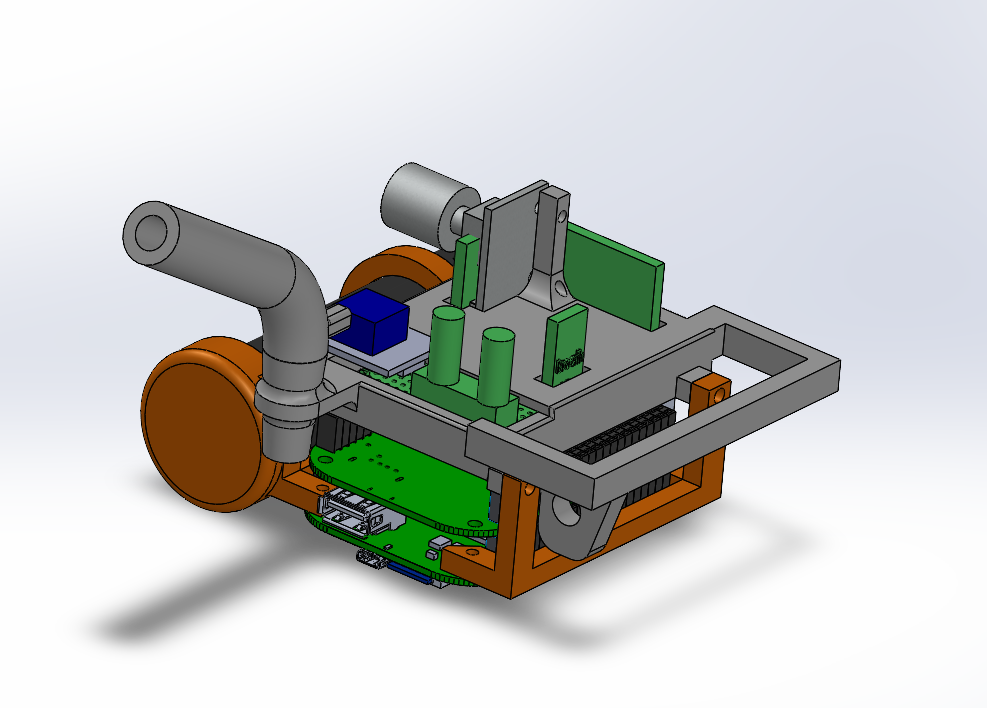
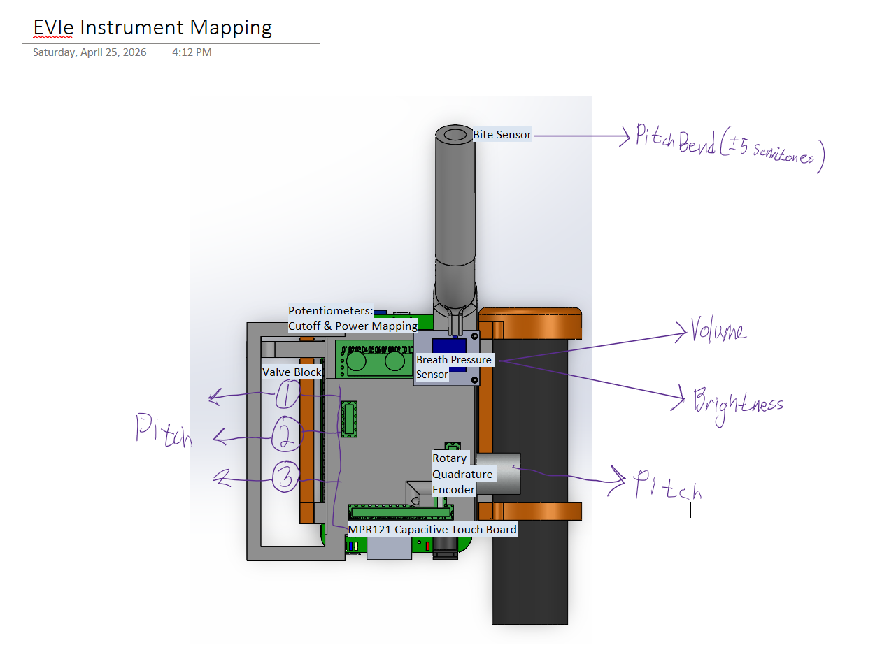
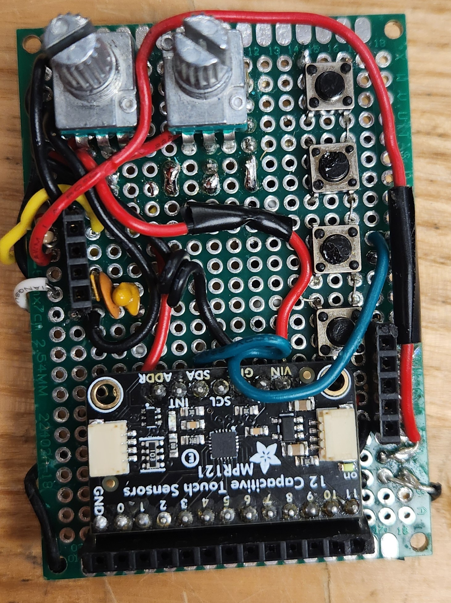
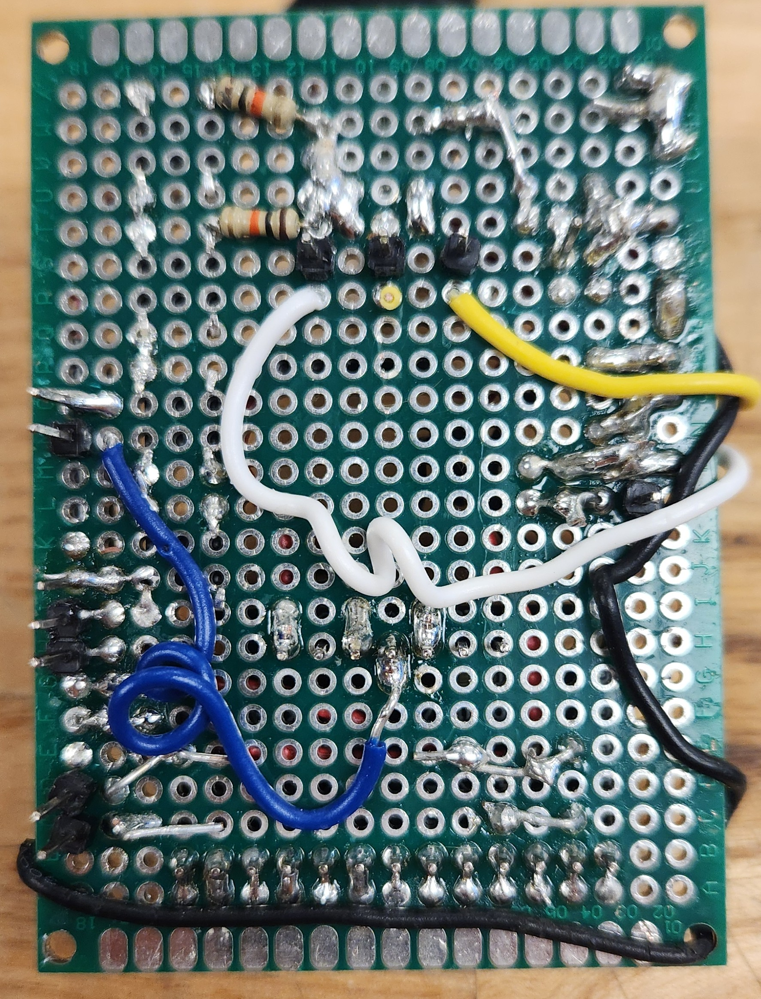
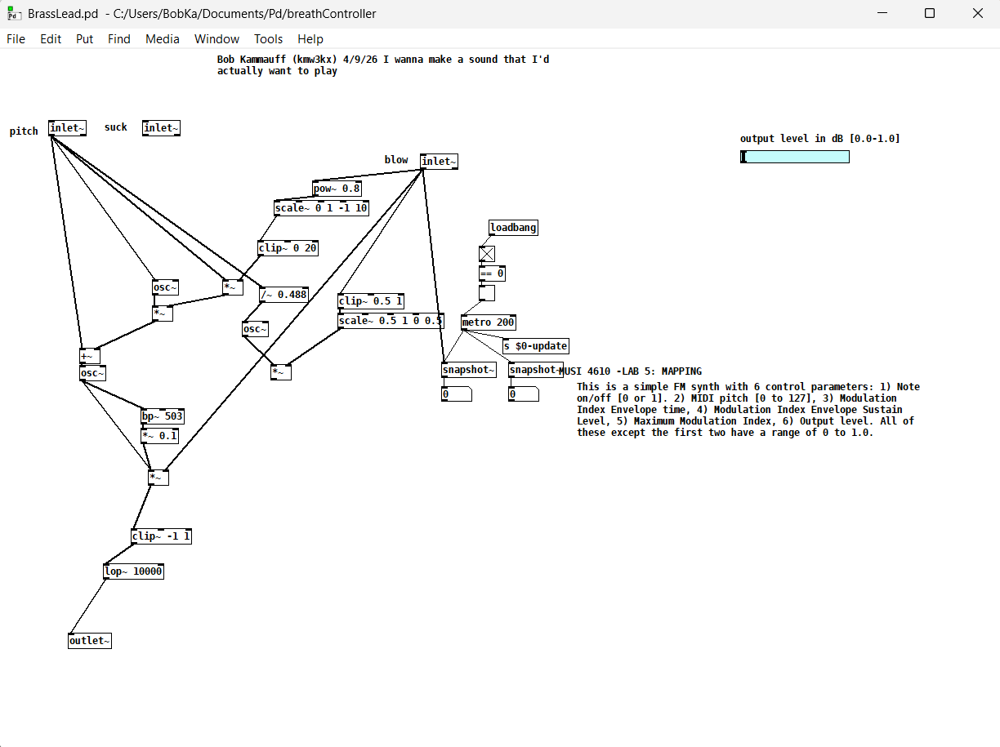
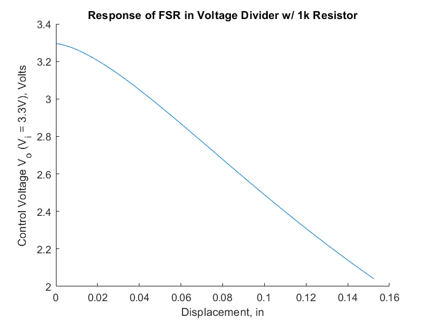
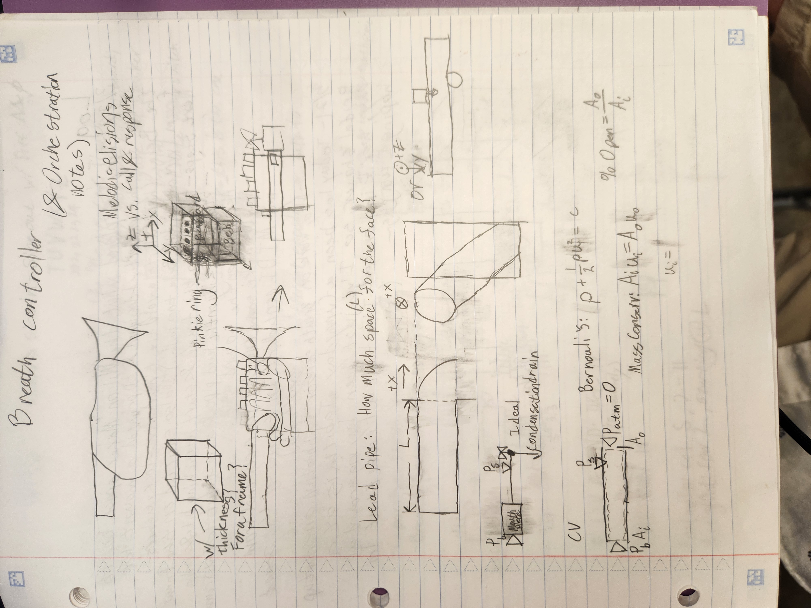
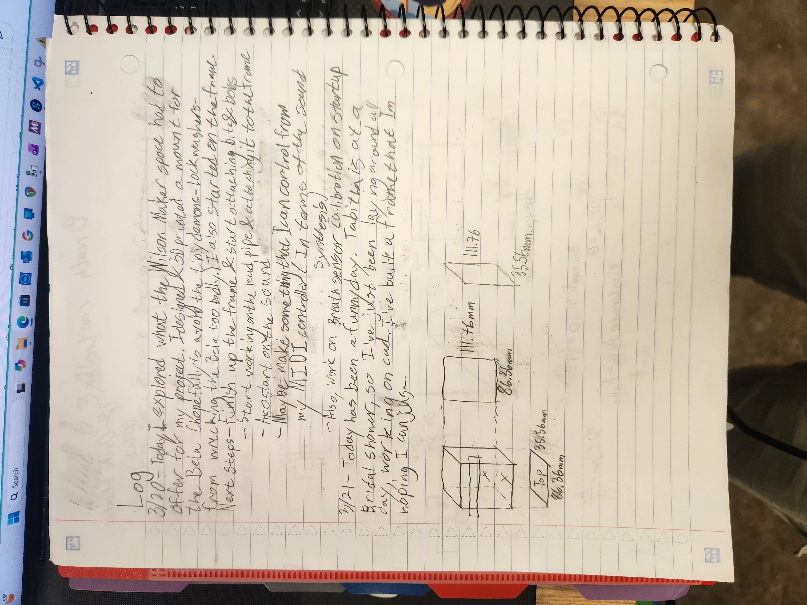
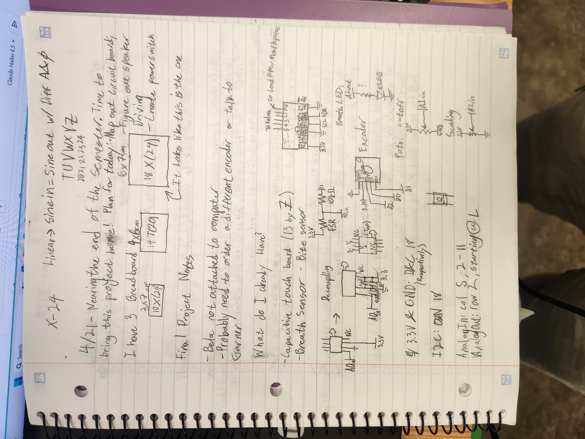
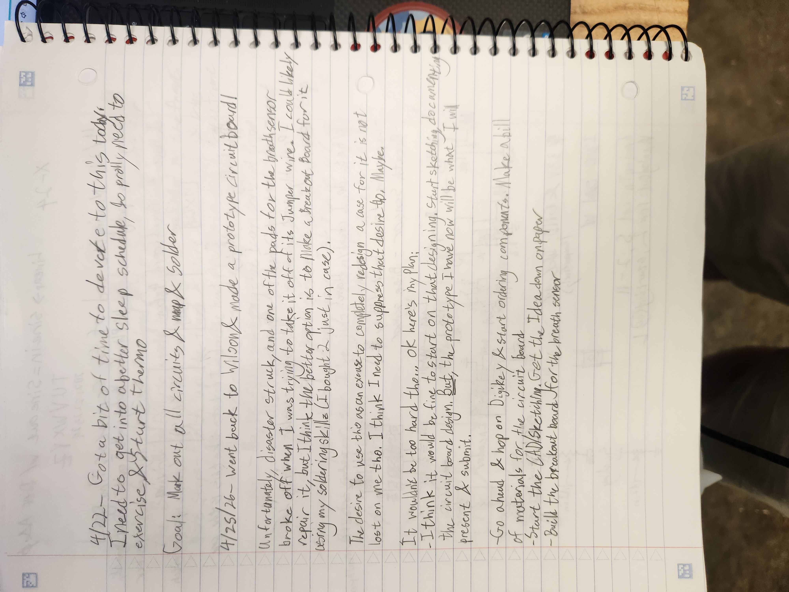

# Breath Controller

This is my repository for my breath controller that I am working on this semester (and hopefully beyond). 

This project was inspired by [this post on hackaday.io](https://hackaday.io/project/25756-diy-evi-style-windcontroller) which used some sort of teensy (that's no longer available) to create a EVI-style breath controller. As such, I use a lot of the same components that he does, but now on a Bela architecture, plus some other revisions (namely, an encoder for the octave selection). 

The basic premise of the instrument is to give brass players access to easily controlling electronic sounds. It uses a pressure sensor connected to a lead pipe in order to determine the breath pressure of the player. The two potentiometers can be used to adjust how the breath signal is interpreted; the one on the left adjusts the cutoff threshold, and the one on the right controls the power mapping. It also has a 'valve block' to allow the player to use the same fingering system developed for brass instruments (1st Valve moves the pitch down a whole step, 2nd Valve down a half step, and 3rd Valve down a minor 3rd). However, a problem instantly arrives: brass musicians usually rely on playing in the harmonic partials of a physical tube in order to expand the range greater than just the tritone provided. So, we need additional controls. I decided on using an encoder as a way to toggle between octaves with a easy motion that still provides a clear source of feedback (clicking with each increment). This worked, but it still wasn't fully chromatic. I experimented with adding a 4th and 5th valve (operated by the pinky and thumb respectively, which lowered and raised the pitch by a 4th), which allows the instrument to be fully chromatic (and have multiple alternate fingerings to allow for more flexibility in tricky passages across the octave split), but this experimentation was still very clunky, since most brass instruments with more than 3 valves start to become less standard and more a product of tuning constraints; most brass players are the most comfortable just using the first 3 valves. So, I decided on a system where the encoder actually start alternating between Bb and F in octaves; the 2nd and 3rd harmonic partial that brass normally starts in. This allows the instrument to be fully chromatic, yet still have the octave shifting feature where each note in any octave is played with the same fingering.
## Mapping

## Wiring

The valves are a combination of stranded core soldered to solid core. I used lock washers to ensure a very sturdy connection between the stranded wire and the bolts I was using for the capacitive touch valves. They are plugged into their corresponding number on the MPR121 (1-5), where 5 is the thumb. The encoder plugs in directly to the 5 female sockets on the right, with the knob facing away. The breath sensor is plugged into the ground port on the MPR, and the white wire side of the 4 female sockets, w/ V_in going to the inner one, and V_out to the outer. If the bite sensor is to be used, it is plugged into the upper 2 sockets; polarity doesn't matter. 

## Sound
The sound of the instrument can be swapped out in the code by attaching the frequency and breath lines into where `BrassLead` currently is. `simpleSound.pd` and `SubSynth.pd` are alternative sound modules. 

`BrassLead.pd` uses a simple FM algorithm to create a sound that increases in brightness w/ respect to breath input.

You can find a link to a video of the instrument being played [here.](https://youtube.com/shorts/NqKi1nieuh8)

## CAD
All CAD files that I used while developing this prototype can be found [here.](https://myuva-my.sharepoint.com/:f:/g/personal/kmw3kx_virginia_edu/IgA0IbZReZuJRZx14ltvIYuoAS6oU6uEX7or4lSNlIzHq_s?e=NXnAmO)

## Future Improvements
There are a ton of improvements that are possible with this instrument and implementation that I am planning on pursuing looking forward:

- Added Features
    - I had started implementing a 'bite sensor' for the instrument using a FSR attached to a small length of 5/8" OD silicone tubing. This was mapped to pitch bend. The tubing acted as a good mouthpiece, as well as giving acting as a spring for the bite sensor to 'bounce back.' I think that I was able to get far enough with it to qualify as a prototype, but the FSR had a very awkward resistance curve(seen below), and it was hard to figure out how to scale it appropriately. The current implementation uses a static resistor (1kOhm I think) to put the instrument at around concert pitch.
    
- I would love for this to be able to both act as a MIDI controller and to be able to adjust settings and presets with a MIDI controller (e.g. to adjust the sound). SubSynth.pd has this MIDI controller connection already built-in.
- Adjustments to sound, control, etc. 

>Project Report:  Due Friday May 10 at 11pm on Canvas.
>Submit the following materials:
>- Your Pd code, and any resources used in the Bela project.
>- A video of your instrument being performed.
>- A report, describing how your instrument works, what your design goals were, what you learned from building it, and what you might change or do differently if you built it again. The report should include a description and diagrams of the user parameters, the synthesis algorithm, and, importantly, the mapping.

## Work Log

### 3/17/26

I am submitting this README as my text file for the `Exercise 3 - Two-Button++ Bela Instrument` assignment. My instrument is a prototype of an EVI that I hope to make into my final project. It takes readings from a pressure sensor, a MPR121 Capacitive Touch board, and a rotary encoder and lets you play it like you would play a trumpet. The sound is just a simple sine wave (& saw wave when suctioned), but it demonstrates the possibilities of using breath for audio synthesis.

### 3/20/26

### 4/22/26

### 4/25/26
